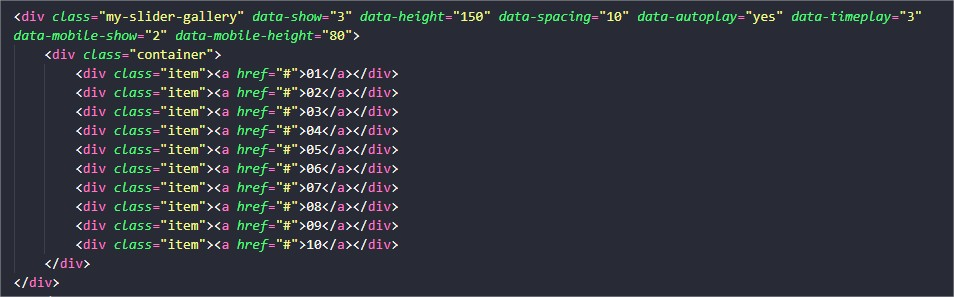

<h1>Galeria Rolante</h1>

<a href="https://jsfiddle.net/phscezario/tyhzdfwg/4/" target="new">Veja aqui</a>

<h2>Como usar:</h2>

<h3>Na DIV pai</h3>

Colocar a classe: "my-slider-gallery" e os atributo "data-height" (altura) e "data-spacing" (espaços entre elementos) são obrigatórios.

<h4>Outros atributos e suas funções:</h4>

data-autoplay="yes" define se a galeria vai trocar as imagens automaticamente.

data-timeplay="3" define tempo em segundos para executar o "autoplay".

data-mobile-show="2" define a quantidade de imagens que iram aparecer em dispositivos móveis.

data-mobile-height="80" define a altura que a galeria vai ter em dispositivos móveis.

<h3>Nas DIVs filhos</h3>

Cada filho é definido por uma DIV com a classe "item": "div class="item"

Qualquer conteúdo pode ser adiciona dentro da DIV filha.

